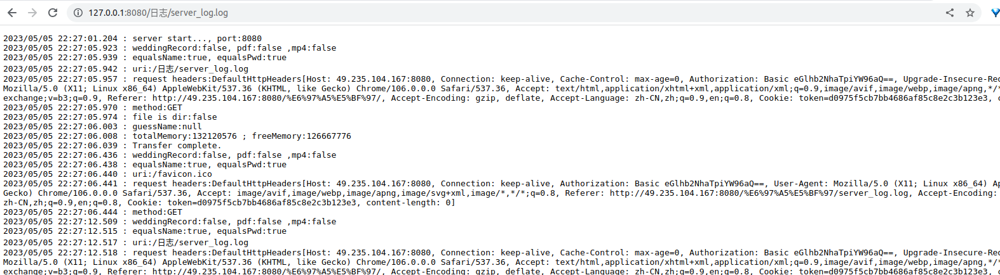
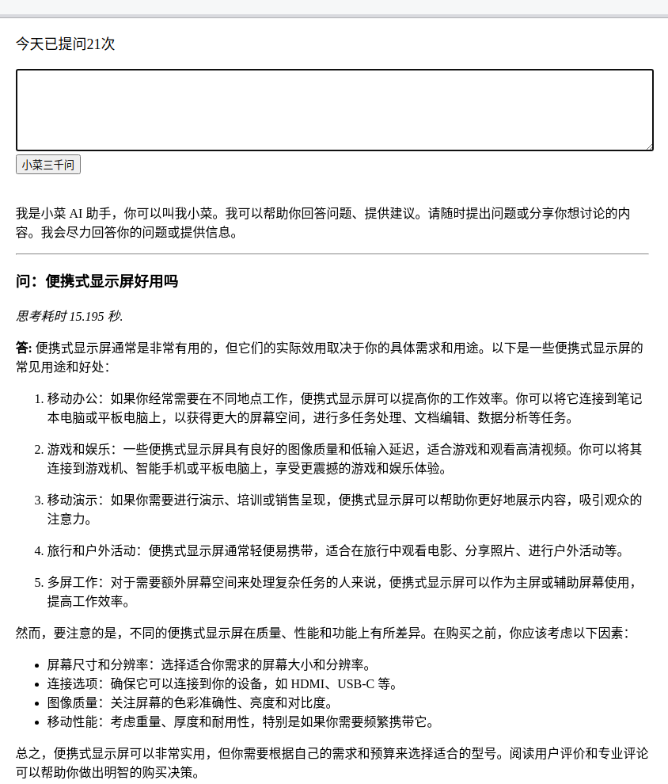

# NimbusCloud/雨云介绍
File server /Yunpan by netty, build project by gradle
* 基于 netty 实现文件服务器/云盘的功能
* 扩展实现了 RestApi 路由功能, 快速对外提供接口能力

## How to start/开始
* git clone git@github.com:xiaokun19931126/NimbusCloud.git
* StarterParams path is must necessary , return your file root path
* ./gradlew start 
* chrome open http://127.0.0.1:8080/, can visit your root file

## Show results /功能展示

* 服务端生成前端代码,浏览器渲染

* 浏览器播放视频

* 文件拖动到网页上传文件

* 网页查看日志
  

* 整合 Chat Gpt

## 模块方案
### 搭建云服务器

### 网站备案

### Nginx 配置

### Netty 深度使用/源码分析

### Netty restApi 路由器 Router 实现

### 本项目前端总结

### Docker 使用

### ChatGpt 整合搭建

### Jenkins 持续集成

### 设计模式

### 内网穿透方案设计与实现

### 产品自驱

## 细化知识点
### Mysql/JDBC 集成使用

### apk 生成二维码

### 注解/反射解耦实现
