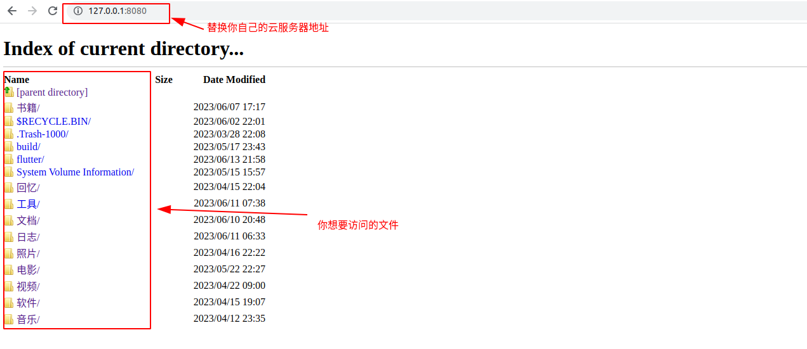
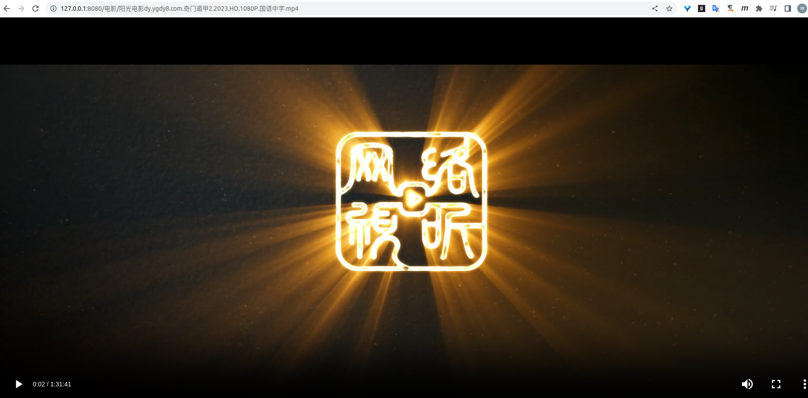
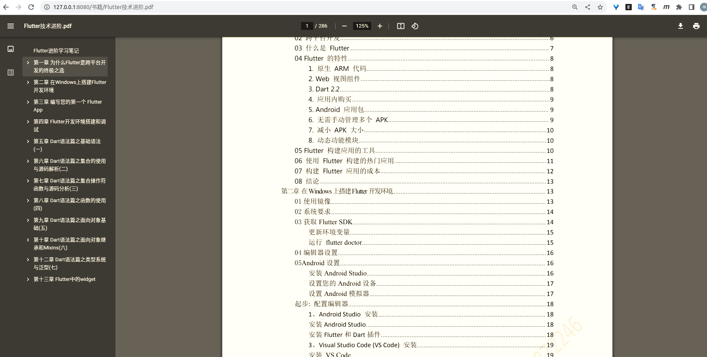

# NimbusCloud/雨云介绍
File server /Yunpan by netty  
实现文件服务器/云盘的功能。

## How to start/开始
* git clone git@github.com:xiaokun19931126/NimbusCloud.git
* StarterParams path is must necessary , return your file root path
* ./gradlew start 
* chrome open http://127.0.0.1:8080/, can visit your root file

## Show results /效果展示

不怎么会前端,索性直接通过服务端把 h5 内容生成后返回给浏览器渲染即可,如下首页.

浏览器自带的通过 http 协议可以播放 mp4 文件,如下,顺便还可以当一个家庭影院,平时上班的时候跑一些脚本自动下载电影.

而且还实现了将文件拖动到网页上传文件的功能,我有时候觉得一些需要收藏或者后期要阅读的 pdf 可以上传到电脑上,以便后期随时查看.chrome 有 pdf 的解析功能很好用.

